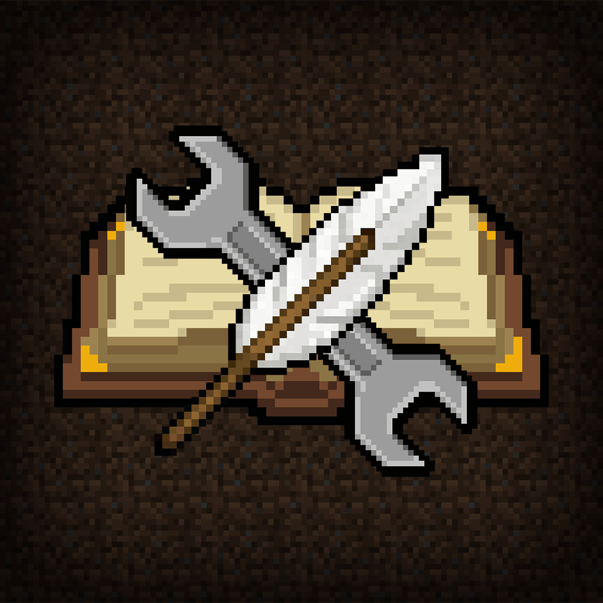

# Edit Everything

**Edit Everything** is a comprehensive Minecraft Fabric mod designed to enhance your Creative Mode experience. Based on the "Advanced Creative Tab" by ATE47, this mod provides a suite of powerful tools for editing items, managing inventories, and utilizing useful commands to streamline your creative workflow.

Whether you are a map maker, a server admin, or just someone who loves to experiment with custom items, Edit Everything gives you the control you need.

## Features

### 🛠️ Advanced Item Editor
Modify every aspect of your items with an intuitive GUI.

#### Meta & Data Components
The Meta tab serves as a hub for advanced item properties.
- **Unbreakable:** Toggle the unbreakable tag.
- **Data Components:** Add, edit, or remove modern data components (1.20.5+).
- **NBT Editor:** Edit raw NBT data directly with a tree-view editor.

#### Adventure Mode (Can Place / Can Break)
Easily configure the `CanPlaceOn` and `CanDestroy` tags for Adventure mode map making. Select blocks from a list to define where items can be used.

#### Container Editor
Edit the contents of containers (Chests, Shulker Boxes, Barrels, etc.) directly without placing them.

#### Command Block Editor
Edit Command Block items (Command, Name, Auto-Execute) directly in your inventory.

#### Attributes
Customize attack damage, attack speed, max health, movement speed, and other attributes.

#### Enchantments
Add any enchantment at any level, even those not normally compatible.

#### Potion Effects
Create custom potions with specific effects, durations, amplifiers, and custom colors.

#### Fireworks
Design custom firework rockets with multiple explosions, colors, and fade effects.

#### Player Heads
Get heads with specific textures or player names.

#### Spawn Eggs
Customize spawn egg entities and their equipment.

### 📦 Item Giver
A powerful alternative to the standard Creative Inventory.
- Search and filter items easily.
- Access custom items and saved palettes.

### ⚡ Instant Tools
- **Instant Click:** Instantly mine blocks without delay.
- **Instant Place:** Place blocks instantly for rapid building.

### 🎨 Color & Formatting
- **Color Modifier:** Change the color of leather armor, potions, and more with a visual picker.
- **Chat Formatting:** Built-in reference for chat color codes (`/ee format`).
- **Palette:** Copy-paste color codes easily (`/ee palette`).

### 🎮 Enhanced Gamemode Switcher (F3 + F4)
Edit Everything enhances the vanilla F3 + F4 gamemode switcher. It allows you to use this shortcut to switch gamemodes even if you don't have standard permission for the vanilla gamemode commands, provided the server supports the switch (or if you are in a singleplayer world where the mod handles the logic).

## Commands

The main command is `/ee` (or `/editeverything`).

| Command | Alias | Description |
| :--- | :--- | :--- |
| `/ee menu` | `/ee om` | Opens the main mod menu. |
| `/ee edit` | `/ee e` | Opens the Item Editor / Giver interface. |
| `/ee give <item>` | `/ee g` | Give yourself an item (supports custom NBT). |
| `/ee opengiver` | | Opens the Item Giver GUI directly. |
| `/ee instantclick` | | Toggles Instant Click (Instant Mine) mode. |
| `/ee instantplace` | | Toggles Instant Place mode. |
| `/ee color` | | Opens the Color Modifier for the held item. |
| `/ee enchant <id> <lvl>` | | Enchants the held item. |
| `/ee rename <name>` | | Renames the held item. Supports `&` for color codes. |
| `/ee unbreakable [bool]` | | Toggles the Unbreakable tag on the held item. |
| `/ee head <name>` | | Gives you the head of the specified player. |
| `/ee randomfireworks` | `/ee rfw` | Gives a randomly generated firework rocket. |
| `/ee info` | | Displays mod version, authors, and license info. |
| `/ee format` | | Shows a list of chat formatting codes. |
| `/ee palette` | | Shows a color palette with copyable codes. |
| `/ee spectatortp <player>` | `/ee sptp` | Teleports to a player (useful for spectators). |

### Gamemode Shortcuts
Quickly switch gamemodes with these commands:
- `/gm <mode>` (e.g., `/gm creative`, `/gm 1`, `/gm c`)
- `/gmc` - Creative Mode
- `/gms` - Survival Mode
- `/gma` - Adventure Mode
- `/gmsp` - Spectator Mode

## Installation

1.  Install **Minecraft** (Version 1.21 - 1.21.11).
2.  Install **Fabric Loader**.
3.  Download **Edit Everything** and place the `.jar` file into your `mods` folder.
4.  Ensure you have the **Fabric API** installed.

## Credits

-   **DutchMTC**: Author / Maintainer
-   **ATE47**: Creator of the original "Advanced Creative Tab" mod.

## License

This project is licensed under the **LGPL-3.0** License.

